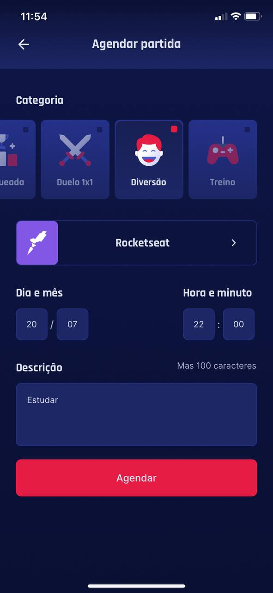

# gameplay
Aplicativo desenvolvido com Expo em React Native durante a Next Level Week 6. 
- IOS e Android

## Conhecimentos adquiridos: 
 - autenticação com Oauth2
 - Integração com discord
 - Contextos e hooks
 - Storage com AsyncStorage
 - Navegação
 - Function Component
 
 

## Para executar o projeto:
Clone o projeto em sua máquina local
Dentro da pasta onde o projeto foi clonado use o comando - yarn - para instalar as dependencias
Execute o comando expo start para iniciar o projeto. (É necessário ter o expo instalado em sua máquina)

<h3 id="aplicacao">Aplicativo</h3>

